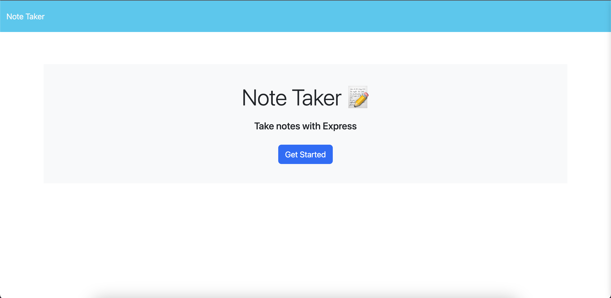
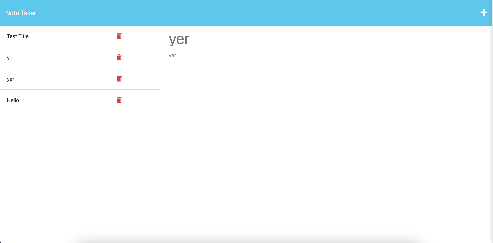

# Note Taker
## Description

This project is a note taking application made using Express and Node.js.

## Installation

To install this project, clone the repository and open terminal. Use the npm install command in the command line to install the required dependencies. 

## Usage

To use the project, open the terminal and run the npm start command. Open your preferred browser and type in the port provided in the server.

